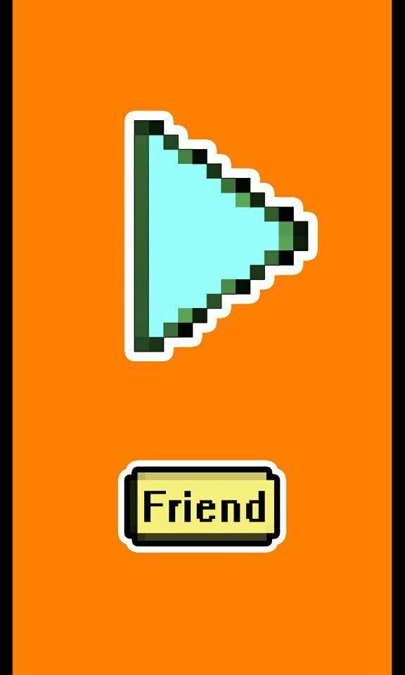
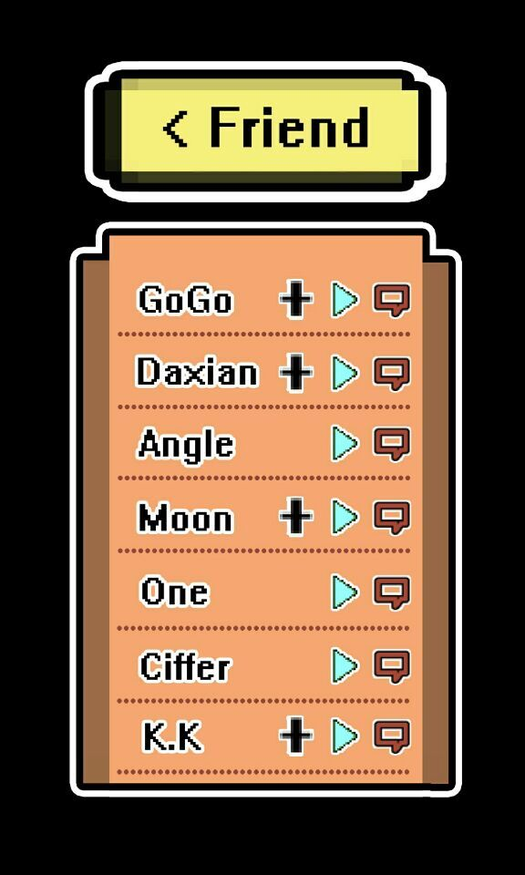
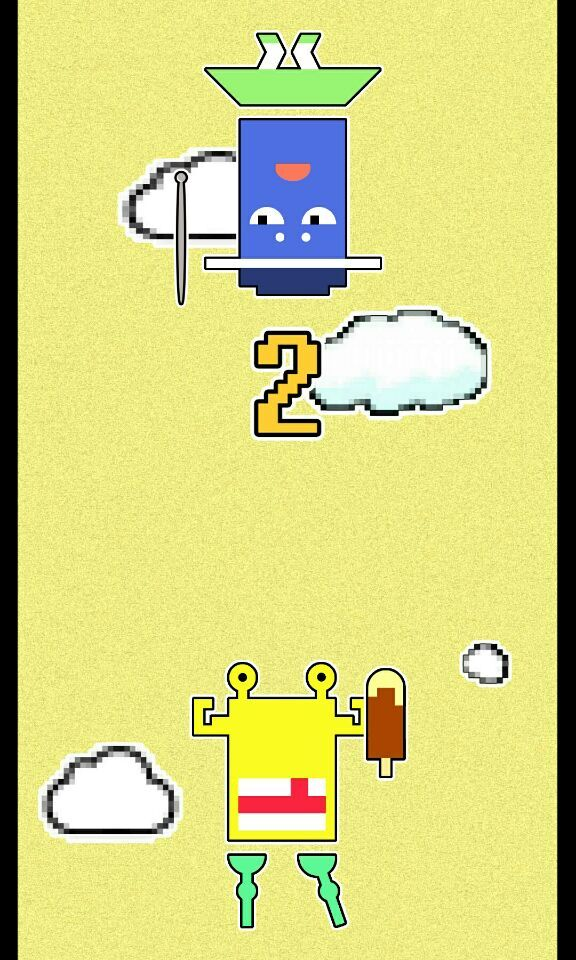
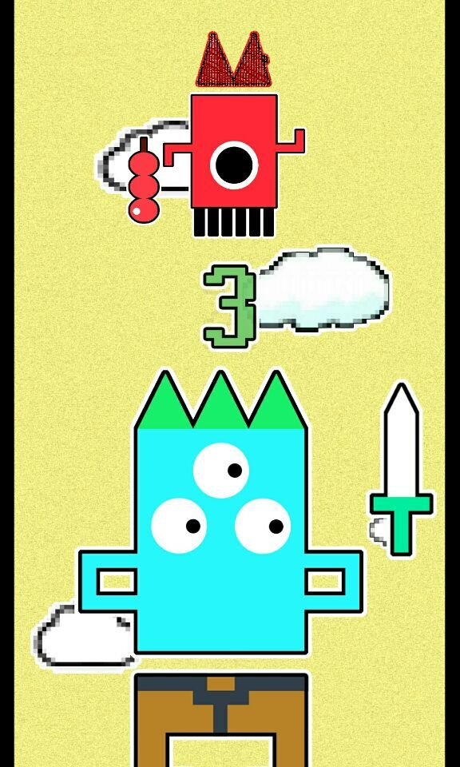
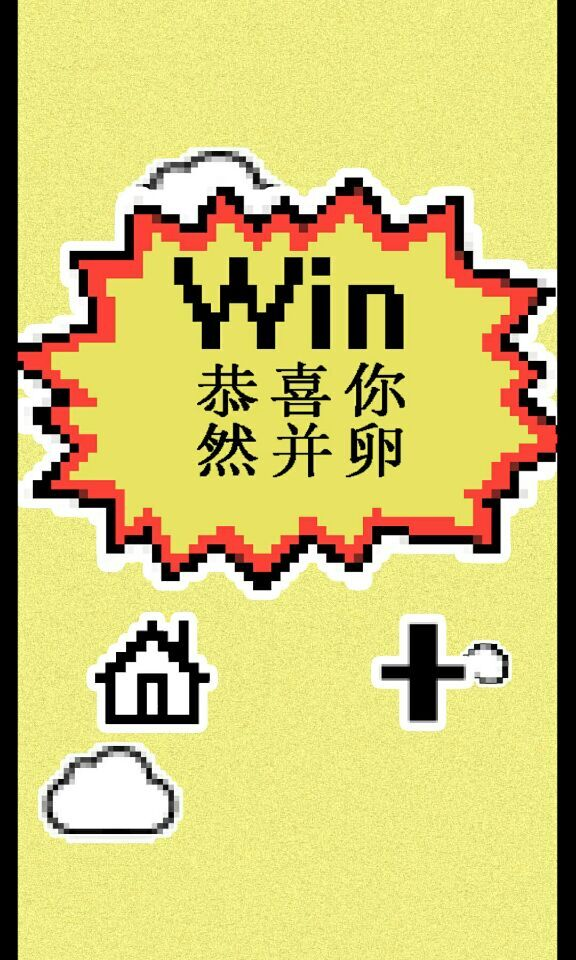

#**嚎友（HaoYou）**

##项目描述

这是一款以像素风格为主的休闲游戏，它的主要游玩方式是通过声音与他人联机对战，我们的目的
不是让人简单地玩一款游戏，而是通过这款游戏与他人进行更加深入的交流；

##团队成员  
* 程序：
	邓浩，唐凯捷
* 美术：
	万奕，张博远
	
##产品预览
###开始界面

###嚎友列表

###PK界面0

###PK界面1

###胜利界面

